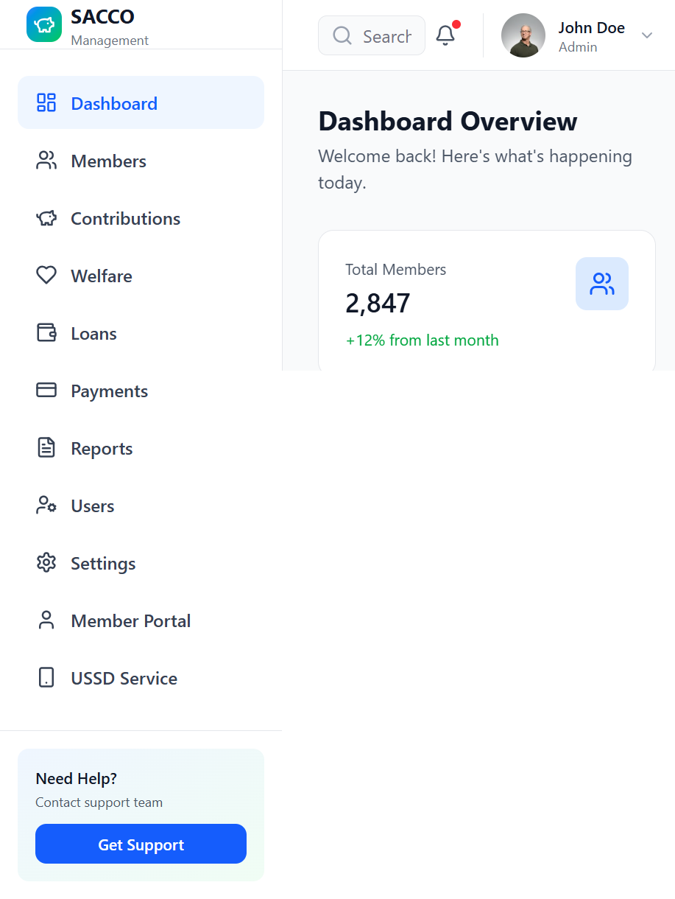
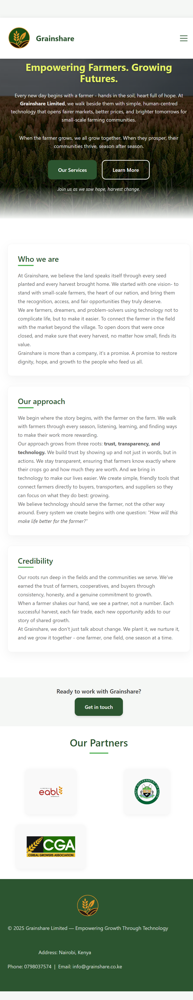

# SACCO Management System

A comprehensive web-based management system for Savings and Credit Cooperative Organizations (SACCOs) operating in Kenya. This application provides complete functionality for managing members, contributions, loans, welfare programs, and financial transactions with a modern, responsive user interface.

## Features

- **Dashboard**: Real-time overview of key financial metrics and statistics
- **Member Management**: Complete member directory with account balances, status tracking, and member profiles
- **Contributions**: Track and manage member savings contributions with transaction history
- **Loans Management**: Process loan applications, track disbursements, and manage repayments
- **Welfare Programs**: Manage welfare events, emergency funds, and social support initiatives
- **Payment Processing**: Record and track all payment transactions across the system
- **Financial Reports**: Generate comprehensive financial reports and analytics
- **Member Portal**: Personal dashboard for members to view their accounts and transactions
- **USSD Service**: Mobile-friendly USSD menu system for members without smartphones
- **User Management**: Manage admin users and system access permissions
- **Settings**: Configure system parameters, payment limits, and business rules
- **Multi-currency Support**: All transactions in Kenyan Shillings (KES)

## Technology Stack

- **Frontend Framework**: React 18+ with TypeScript
- **Build Tool**: Vite
- **UI Components**: shadcn/ui (Radix UI)
- **Styling**: Tailwind CSS
- **Icons**: Lucide React
- **Charts**: Recharts for data visualization
- **Date Handling**: date-fns
- **Component Library**: Material-UI icons

## Getting Started

### Prerequisites

- Node.js 16+ 
- npm or yarn package manager

### Installation

1. Clone the repository:
```bash
git clone https://github.com/Sharon404/Sacco-Management-System.git
cd Sacco-Management-System
```

2. Install dependencies:
```bash
npm install
```

3. Start the development server:
```bash
npm run dev
```

The application will be available at `http://localhost:5173`

### Build for Production

```bash
npm run build
```

This generates an optimized production build in the `dist` directory.

## Project Structure

```
src/
├── app/
│   ├── App.tsx                 # Main application component
│   └── components/
│       ├── Dashboard components
│       ├── MembersPage.tsx
│       ├── ContributionsPage.tsx
│       ├── LoansPage.tsx
│       ├── WelfarePage.tsx
│       ├── PaymentsPage.tsx
│       ├── ReportsPage.tsx
│       ├── UsersPage.tsx
│       ├── SettingsPage.tsx
│       ├── MemberPortalPage.tsx
│       ├── USSDPage.tsx
│       └── ui/                # Reusable UI components
├── styles/                    # Global styles and theming
└── main.tsx                   # Application entry point
```

## Usage

### Navigation

The sidebar provides quick access to all major features:
- Navigate between different modules using the sidebar navigation
- Dashboard shows real-time metrics and recent transactions
- Each module has dedicated pages for specific SACCO operations

### Localization

The application is localized for Kenya with:
- Kenyan Shilling (KES) currency
- Local phone number formats (+254)
- Date formats suitable for Kenyan operations

## Key Features in Detail

### Member Management
- Register and manage SACCO members
- Track member status (active, inactive, suspended)
- View savings balances and loan status
- Monitor member transaction history

### Contributions
- Record monthly savings contributions
- Track contribution payments
- Generate contribution reports
- Set contribution limits and requirements

### Loans
- Process loan applications
- Calculate loan amounts and repayment schedules
- Track loan disbursements
- Monitor repayment status

### Welfare Fund
- Manage welfare programs and events
- Track member contributions to welfare
- Process emergency assistance
- Generate welfare reports

### Reports & Analytics
- Financial summaries and statistics
- Member contribution analysis
- Loan portfolio overview
- Welfare fund status

## System Configuration

The Settings page allows administrators to configure:
- Minimum and maximum contribution amounts
- Loan limits and terms
- Welfare benefit amounts
- System users and permissions

## Notes

- All monetary values are in Kenyan Shillings (KES)
- Phone numbers use Kenyan format (+254)
- The system supports multi-user access with role-based permissions
- Data is managed through the application interface

## Support

For questions or issues with the SACCO Management System, please contact your system administrator.

## License

This project is proprietary and intended for use by authorized SACCO organizations.

## Project Gallery

### SACCO Management System

Live deployment: [https://sharon404.github.io/Sacco-Management-System/](https://sharon404.github.io/Sacco-Management-System/)



### Grainshare

Live deployment: [https://sharon404.github.io/Grainshare/](https://sharon404.github.io/Grainshare/)


